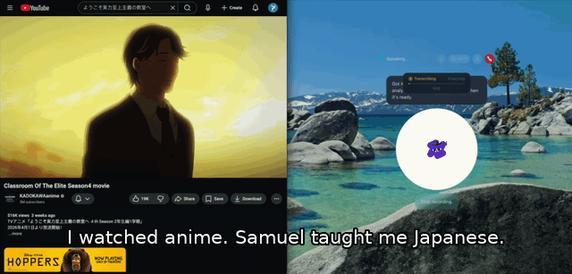

# Samuel — AI Desktop Pet That Watches Your Screen, Listens to Audio, and Teaches You Anything

> An always-listening, always-watching AI companion that floats on your desktop like a virtual pet. Say "Hey Samuel" and he reads your books aloud, watches videos with you, teaches you new languages from any content on your screen, and answers questions by voice — hands-free. Built with Tauri v2 + OpenAI Realtime API.


## Demo

https://github.com/user-attachments/assets/65314d07-694d-47c5-8209-24e5bdbdf55c

### Ambient Learning — Watch Anything, Learn Any Language



Samuel floats on your desktop as a transparent animated character. While you watch videos, browse the web, or work, he **listens to audio and reads your screen simultaneously**, then teaches you interesting vocabulary and grammar in your target language — without you pressing a single button.

Ask him "what did they just say?" and he answers instantly because he was listening the whole time, like a tutor sitting next to you.

---

## Why Samuel?

Most AI assistants live in a browser tab and wait for you to type. Samuel is different — he's **always present on your desktop**, watching and listening alongside you:

- **Watching a video?** Samuel hears the dialogue, reads the subtitles, and teaches you new words in any language
- **Browsing the web?** Samuel notices interesting content on screen and teaches you how to say it in your target language
- **Reading a book?** Samuel reads it aloud and answers follow-up questions from memory
- **Working on something else?** Samuel sits quietly — he's attention-aware and won't interrupt you in deep-focus apps like VS Code or Xcode

He's not a chatbot. He's a **desktop companion** — always visible, always listening, always ready. Think QQ Pet meets JARVIS, but real.

---

## Key Features

### Always-Listening Ambient Agent
Samuel continuously monitors your screen and system audio in the background. Every 20 seconds, he captures what's on screen and transcribes nearby audio — video dialogue, podcasts, music, conversations — and silently absorbs it as context. He won't interrupt unless he spots something genuinely interesting. But when you ask about something that just happened, he knows exactly what you're talking about.

- **Parallel screen + audio monitoring** — both checked every 20 seconds
- **Smart triage engine** — classifies every observation as ignore, notify (subtle text card), or act (voice hint)
- **Attention-aware** — stays silent in deep-focus apps (IDE, terminal, etc.), speaks up when you're available
- **Cross-content teaching** — any content on screen can trigger a learning moment in your target language
- **Persistent memory** — tracks vocabulary already taught, avoids repeating itself for 24 hours
- **Process-filtered audio** — captures system audio but excludes Samuel's own voice

### Voice-First Desktop Companion
- **"Hey Samuel" wake word** — hands-free activation, just like Siri or Alexa
- **Real-time voice conversation** — natural speech-to-speech via OpenAI Realtime API
- **British butler persona** — polished, helpful, slightly formal
- **Always-on session** — no idle timeout; heartbeat keepalive + auto-reconnect with context preservation
- **Transparent floating window** — sits on top of all apps like a desktop pet
- **Rive character animation** — animated states: idle, listening, thinking, speaking
- **Manga-style speech bubbles** — frosted-glass aesthetic with backdrop blur

### Smart Book Reading (Apple Books)
- **Read any page aloud** — captures the page as an image, reads it via Realtime API
- **Full chapter reading** — automatically turns pages and reads until the next chapter
- **Visual navigation** — GPT-5.4 Computer Use sees your screen and clicks through the UI
- **Follow-up questions** — "What did that paragraph mean?" — answers from memory

### Language Learning From Any Content
Samuel supports **any language** — set your target language by voice and he adapts:

- **Real-time screen translation** — captures your screen, translates all visible foreign text
- **Grammar breakdown** — sentence structure, particles, conjugation, politeness levels
- **Pronunciation coach** — speaks words slowly then naturally, with accent tips
- **Recording mode** — captures system audio from video, provides full vocabulary + grammar analysis
- **Cross-language moments** — sees English content and teaches the equivalent in your target language
- Works with Japanese, Chinese, Korean, Spanish, French, German, Portuguese, Arabic, and more

### Session Resilience
- **Heartbeat keepalive** — pings every 30s to prevent server-side idle timeout
- **Session rotation** — auto-reconnects every 25 min before the 60-min hard cap
- **Context preservation** — last 6 conversation turns replayed on reconnect
- **Auto-reconnect on drop** — detects unexpected disconnects and recovers in 2 seconds

---

## How It Works

```
You speak → "Hey Samuel" wake word → OpenAI Realtime API → Samuel picks tools → Voice response
         ↕                                                    ↕
   Always listening                                  Always watching screen
   (system audio via                                 (GPT-4o Vision every
    ScreenCaptureKit)                                 20s, change detection)
```

Samuel is a voice agent built on OpenAI's Agents SDK (`@openai/agents/realtime`). He listens through your microphone and responds with natural speech. When you ask him to do something, he picks the right tool:

| What you say | What happens |
|---|---|
| "Read this page" | Captures Apple Books page, reads it aloud |
| "Summarize chapter 9" | Reads every page via Vision API until next chapter |
| "Go to chapter 6" | GPT-5.4 Computer Use navigates the app visually |
| "Look at my Chrome" | Captures Chrome window on any monitor |
| "Translate my screen" | Translates all visible foreign text |
| "Explain this grammar" | Breaks down grammar for any language on screen |
| "How do you say 'cat'?" | Pronounces it in your target language |
| "Start recording" | Captures system audio for deep analysis later |
| "I'm learning Spanish" | Activates ambient learning mode for Spanish |
| "What did they just say?" | References ambient audio transcripts to answer |

---

## Architecture

```
src/                          React frontend (Vite + TypeScript)
├── App.tsx                   Main app + wake word flow
├── hooks/
│   ├── useRealtime.ts        Realtime API: heartbeat, reconnect, context replay
│   ├── useWakeWord.ts        "Hey Samuel" detection (Whisper + cross-clip matching)
│   ├── useRecordMode.ts      System audio recording + analysis pipeline
│   └── useLearningMode.ts    Ambient agent: parallel audio+screen, triage, silent context
├── lib/
│   ├── samuel.ts             Agent persona, 15 tools, ambient awareness instructions
│   ├── session-bridge.ts     Bridges: image, text, silent context, recording, learning
│   └── sounds.ts             Audio cues (chime on wake, tone on idle)
├── components/
│   ├── Character.tsx          Rive animation + manga speech bubbles
│   ├── PassiveSuggestion.tsx  Frosted-glass hint card for ambient observations
│   ├── ScreenPicker.tsx       Multi-monitor display selector
│   └── StatusBar.tsx          Connection state display
└── styles/app.css             Transparent window, animations

src-tauri/                    Rust backend (Tauri v2)
├── helpers/
│   └── record-audio.swift    ScreenCaptureKit audio capture with PID filtering
└── src/
    ├── lib.rs                Tauri setup + macOS window transparency (Cocoa)
    ├── commands.rs           Screen capture, Vision API, Computer Use, audio pipeline,
    │                         triage engine, ephemeral keys, display detection
    ├── memory.rs             Persistent memory: vocabulary, transcripts, observations
    └── wake_word.rs          Whisper-based wake word with cross-clip matching
```

### Multi-Model Strategy

| Model | Used for | Speed |
|---|---|---|
| **OpenAI Realtime API** | Voice conversation, page reading, translation, grammar | ~2s |
| **GPT-4o Vision** | Screen scanning, chapter reading, ambient observation | ~3-5s |
| **GPT-4o-mini** | Triage engine (ignore/notify/act classification) | ~1s |
| **GPT-5.4 Computer Use** | Visual navigation (click, scroll, type in apps) | ~5-10s/turn |
| **gpt-4o-mini-transcribe** | Wake word detection, ambient audio transcription | ~1s |
| **gpt-4o-transcribe** | Recording mode (high-quality transcription) | ~3-10s |

---

## Tech Stack

| Layer | Technology |
|---|---|
| Desktop Framework | [Tauri v2](https://v2.tauri.app) (Rust + WebView) |
| Frontend | React 19 + Vite + TypeScript |
| Voice AI | [OpenAI Realtime API](https://platform.openai.com/docs/guides/realtime) |
| Agent Framework | [`@openai/agents`](https://github.com/openai/openai-agents-js) (Agents SDK) |
| Vision AI | OpenAI GPT-4o Vision |
| Computer Use | OpenAI GPT-5.4 (Responses API) |
| Character Animation | [Rive](https://rive.app) (`@rive-app/react-canvas`) |
| Screen Capture | [Peekaboo](https://github.com/nicklama/peekaboo) + macOS `screencapture` |
| System Audio | ScreenCaptureKit (Swift, with process-level filtering) |
| Window Transparency | Cocoa NSWindow APIs via `macos-private-api` |
| Styling | Tailwind CSS + custom animations |

---

## Quick Start

### Prerequisites
- **macOS 14+** (Sonoma or later)
- **Node.js 20+**
- **Rust** ([rustup.rs](https://rustup.rs))
- **OpenAI API key** with Realtime API + GPT-4o + GPT-5.4 access

### Install

```bash
# 1. Install Peekaboo (screen capture + automation)
brew install steipete/tap/peekaboo

# 2. Clone and install
git clone https://github.com/sambuild04/reading-ai-agent.git
cd reading-ai-agent
npm install

# 3. Compile the audio helper
swiftc -o src-tauri/helpers/record-audio src-tauri/helpers/record-audio.swift \
  -framework ScreenCaptureKit -framework AVFoundation -framework CoreMedia

# 4. Set your API key
echo '{"apiKey": "sk-..."}' > ~/.books-reader.json

# 5. Grant Screen Recording permission
# System Settings → Privacy & Security → Screen Recording → add peekaboo + samuel

# 6. Run
npm run tauri:dev
```

Then say **"Hey Samuel"** and start talking.

---

## Example Conversations

**Reading a book:**
> "Samuel, read this page for me."
> *Samuel captures the Apple Books page, reads it aloud in his British butler voice*
> "What does the author mean by 'antifragile'?"
> *Answers from memory without re-reading*

**Watching a video with learning mode:**
> "I'm learning Korean."
> *Learning mode activates. Samuel starts monitoring screen + audio.*
> *While watching a K-drama:*
> "Sir, I just caught an interesting phrase — 괜찮아 means 'it's okay.' The informal tone here shows they're close friends."
> "What did the main character say before that?"
> *Samuel recalls the dialogue from his ambient audio buffer and translates it*

**Browsing the web:**
> *Samuel sees English text about cooking on your screen*
> "Do you know how to say 'recipe' in Spanish, sir? It's 'receta' — from the Latin 'receptus.'"

**Multi-monitor:**
> "Look at my Chrome" *(Chrome is on a different display)*
> *Samuel finds Chrome, captures the right monitor, and describes what he sees*

---

## Use Cases Beyond Language Learning

The ambient agent architecture — always watching the screen, always listening to audio, silently building context — is a general-purpose pattern. Samuel demonstrates it for language learning, but the same approach works for:

- **Meeting assistant** — listens to Zoom/Teams calls, takes notes, answers "what did they say about the deadline?"
- **Coding companion** — watches your IDE, notices errors, suggests fixes when you look stuck
- **Accessibility** — reads screen content aloud for visually impaired users
- **Research assistant** — monitors your browser tabs, summarizes articles, remembers what you read
- **Content creator** — watches your editing timeline, offers suggestions, remembers your style preferences
- **Study buddy** — watches lecture videos with you, quizzes you afterward on key concepts

---

## Planned Features

- **Local wake word** — on-device detection for instant, offline, zero-cost activation
- **Custom character** — design your own companion with AI-generated assets + Rive
- **Anki flashcard export** — auto-generate cards from vocabulary discovered during sessions
- **iOS/Android companion** — same voice agent on mobile
- **Plugin system** — extend Samuel with custom tools and behaviors
- **Multi-language simultaneous** — learn two languages at the same time

## Limitations

- **macOS only** — relies on Apple Books, Peekaboo, and ScreenCaptureKit
- **DRM content** — protected books may produce black screenshots
- **API costs** — wake word ~$0.006/min; ambient mode ~$0.02-0.05/min (Vision + transcription + triage); book reading ~$0.01/page
- **GPT-5.4** — Computer Use navigation requires GPT-5.4 API access
- **Copyright** — Vision API may refuse to transcribe copyrighted text verbatim

---

## Contributing

Contributions welcome! Samuel is a solo project but the ambient agent pattern has a lot of unexplored potential. Open an issue or PR if you have ideas.

## Star History

If Samuel is useful to you, please star the repo — it helps others discover the project.

## License

MIT

---

**Built by [Sam Feng](https://github.com/sambuild04)**
